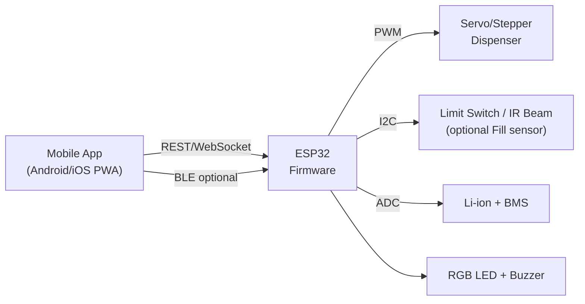

# Project Good Boy

**Mission:** Quick, reliable, serverless treat dispensing that respects accessibility and privacy.

Project Good Boy is a battery-powered, wheelchair-mountable dog treat dispenser built around an ESP32. Trigger treats from a simple phone app over your local network, with optional Bluetooth fallback and a direct-access Wi-Fi AP mode for setup and offline use. The system charges over USB-C and prioritizes accessibility-first interaction.

---

## Features

- **Wi-Fi Control:** Operates entirely on your local network—zero cloud required.
- **BLE Fallback:** Optional Bluetooth Low Energy path for redundancy.
- **Direct AP Mode:** Built-in access point for provisioning and offline control.
- **USB-C Charging:** Safe battery management with protected cells or BMS.
- **Accessible Enclosure:** Compact, wheelchair-mountable with quick-swap treat tube.
- **Local REST API & Web UI:** Host and control everything directly from the device.
- **Feedback:** Haptic-ready interface with LED and buzzer confirmation cues.
---

## System Architecture


- **Station Mode:** Joins your home Wi-Fi and exposes a Web UI plus REST API.
- **AP + Captive Portal:** Supports first-time setup and offline control.
- **BLE:** Provides simple characteristics to fire a dispense and read status.

---

## Hardware (Reference Design)

- **MCU:** ESP32-S3 or ESP32-C3 dev board with USB-C (e.g., `ESP32-S3-DevKitC`, `TinyS3`).
- **Actuator:**
  - **Servo Option:** 5 V hobby servo (preferably metal gear) driving a rotating gate.
  - **Stepper Option:** NEMA 17 plus driver (e.g., `DRV8833`, `A4988`) for an auger.
- **Power:** Single 18650 Li-ion or 2-cell pack with protection BMS.
- **Charging:** USB-C 5 V input using `MCP73831`, `TP4056`, or PD sink if required.
- **Regulation:** 5 V buck for servo, 3.3 V LDO for ESP32.
- **Sensors (Optional):** Lid switch, IR break-beam for jam detection, battery voltage divider.
- **UI:** RGB status LED, piezo buzzer, optional physical dispense button.
- **Mounting:** RAM-ball or clamp mount with quick-release bracket.
- **Safety:** Reverse polarity protection, fuse, thermal considerations, protected cell or BMS.

---

## Software Overview

### Firmware (ESP32)

- Platform: PlatformIO or ESP-IDF.
- Modules: Wi-Fi manager, AP provisioning, REST API, Web UI, BLE GATT (optional), actuator control, debouncing, battery monitor, logging.

### Mobile App

- Start with an install-free PWA served by the ESP32.
- Later expand to a native wrapper or Flutter app using the same REST calls and optional BLE.

---

## REST API (Local)

- **POST** `/api/dispense` → body `{ "count": 1 }`
- **GET** `/api/status` → returns Wi-Fi state, RSSI, battery, last dispense time, firmware version.
- **POST** `/api/calibrate` → configure open/close angles or step counts.
- **POST** `/api/config/wifi` → update SSID, password, device name.
- **GET** `/api/logs` → retrieve recent events and error codes.

All endpoints are local-only by default, with optional password or device PIN security.

---

## BLE GATT (Optional)

- **Service:** GoodBoy Service.
- **Characteristic `DISPENSE`:** Write `0x01` to trigger dispensing.
- **Characteristic `STATUS`:** Notifies battery percentage and last dispense result.
- **Characteristic `CFG`:** Supports basic calibration bytes.

---

## Power and Charging

- Target runtime: Several days of light use.
- Servo burst current: 500 mA to 1 A—size the buck converter accordingly.
- Charge via USB-C at 5 V (negotiate only the 5 V PD profile if using USB-C PD).
- Monitor cell voltage via ADC and surface status in the Web UI.

---

## Mechanical Considerations

- Enclosure splits into electronics bay and food-contact tube.
- Rotating gate or auger metes out ~1 treat per trigger.
- Provide an easy cleanout path and jam access hatch.
- Wheelchair mount with adjustable angle and reach.
- Prefer `PETG` or `ABS` for structural parts; use `PETG` or `Nylon` for food-contact surfaces.

---

## Accessibility

- Large, high-contrast on-screen buttons.
- Optional double-tap confirmation to avoid accidental triggers.
- Haptic/audio confirmation in-app and buzzer chirps on-device.
- Compatible with switch access and system-level voice assistants.

---

## Getting Started

### Local testing (no hardware)

You can run unit tests on your Windows machine without any ESP32 connected using PlatformIO's native environment.

1. Install PlatformIO (VS Code extension or CLI).
2. From the project root, run:

```bash
pio test -e native
```

This builds and runs tests under `test/` against portable code in `lib/` (e.g., `lib/core/backoff.h`). The embedded `src/` firmware is excluded for the native target.

If you see a compiler/toolchain error on Windows, install the Visual Studio Build Tools (C++) or let PlatformIO auto-install the MinGW toolchain when prompted.

### Local Web Simulator (mobile UI)

Run a phone-optimized web app locally with mock REST endpoints that mimic the ESP32.

1. Install Node.js LTS (includes npm): https://nodejs.org/en
2. In `web/` run:

```bash
npm install
npm start
```

3. Open the UI:
   - On this machine: http://localhost:3000
   - On your phone (same Wi‑Fi): http://<your-computer-ip>:3000
     - Find IP via `ipconfig` (Windows). Allow Node.js through the firewall if prompted.

What’s included:
- Big, single "Dispense" button on the main tab, plus count control
- Tabs for Calibration and Logs
- Compact status bar (device name, Wi‑Fi, battery, firmware)

Endpoints implemented by the simulator:
- `POST /api/dispense` `{ count }` → enqueues a simulated dispense with jam probability
- `GET /api/status` → device status with changing RSSI/battery
- `POST /api/calibrate` → updates in-memory calibration
- `GET /api/logs` → recent events

### Hardware Assembly

1. Print or build the enclosure and mounting hardware.
2. Install the ESP32, power components, actuator, and sensors.
3. Wire according to the reference schematic in `hardware/`.

### Flash Firmware

1. Install PlatformIO.
2. Copy `firmware/env.sample.ini` to `firmware/env.ini` and set the board and port.
3. Run `pio run -t upload -e esp32s3`.

### First Boot

1. Device starts in AP mode (`GoodBoy-XXXX`) with captive portal.
2. Open the portal to set SSID, password, and device name.

### Calibrate

1. Visit `http://goodboy.local` or the displayed IP address.
2. Set open and close positions, test dispensing, and save.

### Use

1. Open the Web UI or app.
2. Press **Dispense**.
3. Celebrate a very good dog.

## Build Tree

```
project-good-boy/
├─ src/                 # ESP32 firmware (Arduino/PlatformIO)
├─ include/             # Headers/config
├─ lib/                 # Portable libraries (e.g., core/)
├─ test/                # Native unit tests (PlatformIO env:native)
├─ web/                 # Local simulator (Express + mobile web UI)
```

---

## Roadmap

- **v0.1 Prototype:** Servo gate, AP provisioning, single dispense.
- **v0.2:** Wi-Fi station mode, REST API, Web UI, calibration storage.
- **v0.3:** BLE fallback, battery monitor, status LED and buzzer.
- **v0.4:** Jam detection, treat count analytics, watchdog, OTA update.
- **v1.0:** Enclosure refinements, full documentation, assembly guide.

---

## Security and Privacy

- Local-only by default with no cloud dependency.
- Optional device PIN for REST endpoints.
- mDNS name discovery on LAN (can be disabled in firmware).
- OTA updates should be signed or disabled by default.

---

## Contributing

Issues and PRs are welcome. Please open an issue before proposing mechanical or electrical changes, and document any safety considerations.

---

## License

MIT License — see `LICENSE`.

---

## Credits

Concept and accessibility requirements by the project owner. Built with love for a very good boy.
