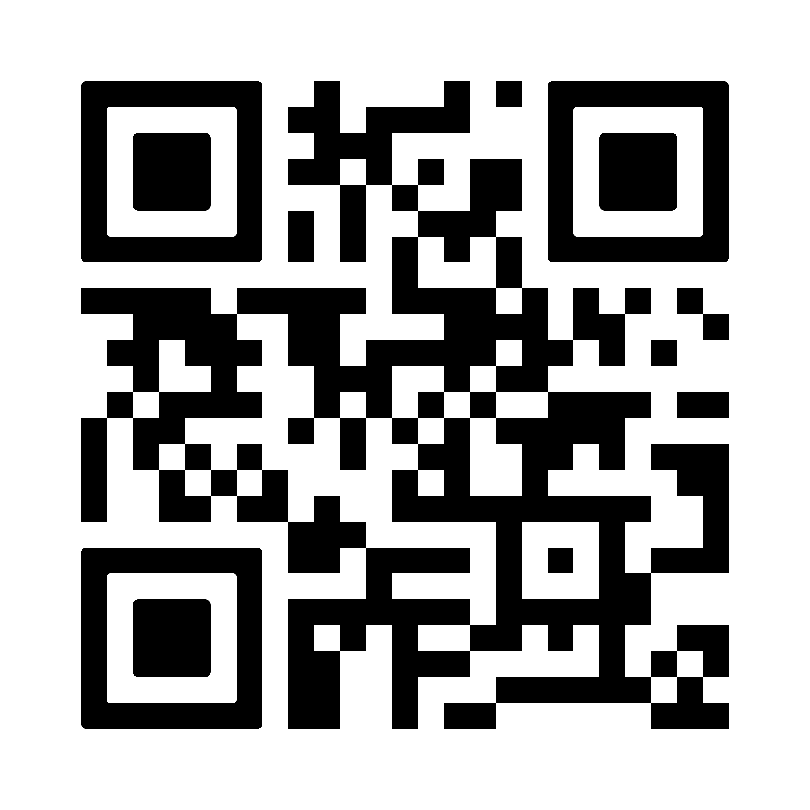

# Project Good Boy

An open-source battery powered dog treat dispenser that is activated via a web interface and is wheelchair mountable.
It is currently compatible with being mounted on 40x40 aluminum extrusions. 

**Want one built for you? Or modifications/additional support?** Reach out—we'd be happy to help!

If you are interested in us developing this as a product, please take the survey.

Survey: https://tinyurl.com/m8z8fjtb

---

## Contact

Owen Kent - https://okstud.io/

Marshall Saltz - https://saltztech.com/

---

## Features

- **Wi-Fi Control** — Operates on your local network or as its own access point
- **Web Interface** — Phone-friendly UI served directly from the device
- **Battery Powered** — Uses a 12 V Lipo to power the system
- **Accessible Design** — Large buttons, simple controls, wheelchair-mountable
---

## Bill of Materials

| Component | Amount | Link |
|-----------|-------------|------|
| Battery | 1 | [Amazon](https://www.amazon.com/dp/B0D9D8ZSV9) |
| Nema 17 Stepper Motor | 1 | [Amazon](https://www.amazon.com/dp/B07PNV7RBW) |
| TMC2209 Stepper Motor Driver | 1 | [Amazon](https://www.amazon.com/dp/B07ZPYKL46) |
| 12V to 5V DC Converter | 1 | [Amazon](https://www.amazon.com/dp/B08VHZJ3C8) |
| 8mm M3 Bolts | 4 | [Amazon](https://www.amazon.com/dp/B0C7ZRTH3Q) |
| Jumper Wires | —| — |
| Filament (preferably PETG) | — | — |
| T-nuts for mounting | 5 | — |
| T-nut compatible bolts | 5 | — |
| ESP32 Dev Kit | 1 | — |
| Wagu Wire Connectors | — | — |
| ArtResin or another safe resin | — | — |
| 100 uF Capacitor | 1 | - |

---

### Tools Required

- Pliers
- Electronics screwdriver
- USB-C cable (for uploading firmware and charging)
- 3D printer
- Flat edge screwdriver

---

## Wiring

---

## Building & Uploading

### Assembly Instructions

Assembly video or image series needed here!

### Prerequisites

Install [Arduino IDE](https://www.arduino.cc/en/software)
Required libraries:
   - `Wifi`
   - `ESPAsyncWebServer.h`
   - `AsyncTCP`
   - `DNSServer`
   - `ESPmDNS`
   - `LittleFS` [Random Nerd Tutorials](https://randomnerdtutorials.com/esp32-littlefs-arduino-ide/)

### Upload Firmware

1. Download module_ver/project_goodboy folder

2. Connect the ESP32 via USB-C and open project_goodboy.ino in Arduino IDE
   
3. Upload the data folder to the ESP32 using LittleFS (See [Random Nerd Tutorials](https://randomnerdtutorials.com/esp32-littlefs-arduino-ide/) for further instruction)

4. Upload sketch

## Usage

### First Boot (Access Point Mode)

1. Power on the device
2. Connect to Wi-Fi network: **GoodBoy** (password: `buddythedog`)
3. Open browser: `http://192.168.4.1` if pop-up does not open automatically

4. Enter your home Wi-Fi credentials to connect the device to your network

### Normal Operation

1. Connect to the same Wifi network as the device
2. Open browser: `http://goodboy.local` (or check serial output for IP)
3. Use the web interface:
   - **Dispense** — Triggers the motor to dispense a treat
   - **Speed** — Adjusts motor speed

Can also be used in AP mode by following steps 1-3 of First Boot

---

### Maintainance
This dispenser must be cleaned regularly. To clean, wipe down with a damp paper towel or food-safe cleaner. The parts can be submerged for a deeper clean as long as all electronics are disconnected including the motor and sensors.

---

## TODO

- [ ] Include assembly instructions/video
- [ ] Video of operation
- [ ] Include sensor instructions, aperture models, etc.
---

## Contributing

Issues and PRs welcome! Please open an issue before proposing major changes.

---

## License

MIT License — see `LICENSE`.

---

## Credits

Built with love for a very good boy.
